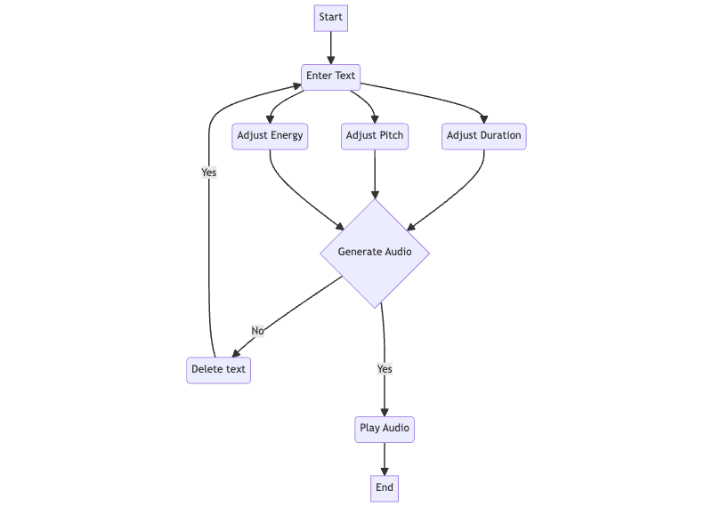
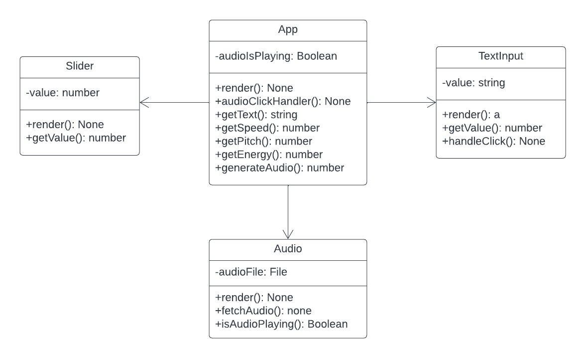

# Project outline

## NRC Text-to-Speech project outline

Canada is home to about 70 Indigenous languages from 10 different language groups. Fewer than 500 fluent speakers of the majority of these languages remain today, with most of them being old, as a result of the residential school system and other practices of cultural suppression.

In spite of this, Indigenous people have continued to speak their native tongues and defy colonial rules, with parents and students becoming increasingly interested in teaching Indigenous languages. Due to the rise of online learning, many students who did not previously have access to language lessons now do so, which frequently overwhelms teachers. Supporting these expanding student cohorts poses unique difficulties in languages with a dearth of native speakers. Providing pupils with the opportunity to hear the language outside of class is of particular interest to teachers.

While there is no substitute for a native speaker of an Indigenous language, speech synthesis (also known as text-to-speech) has potential applications for enhancing text-based resources like verb conjugators, dictionaries, and phrasebooks.

To cater to the needs, design a web-based user interface to interact with an English text-to-speech model.

Depending on the input symbols used by the supplied model, user input received via the interface should be translated from plain text to either the International Phonetic Alphabet (IPA) or Arpabet character tokens (TBD). Each input token will have changeable energy, pitch, and duration due to FastSpeech2's design. The task is to determine the most effective approach to communicate with the model using a web interface that can perform simple text-to-speech synthesis and offer user control over changing the energy, pitch, and length.

## User stories

- As a teacher, I need a web-based user interface that can convert any text to speech so that I can integrate this text-to-speech technology in any classroom for various indigenous languages.
- As a learner of an Indigenous language, I want to be able to listen to pronunciations of words that I enter into a system, so I can learn to pronounce them correctly.
- As an indigenous teacher, I want to have a tool that can produce speech using text in the indigenous language, so that it can be learned by more indigenous students.
- As a learner of an Indigenous language, I would like to adjust the speed, pitch, and duration of the pronunciation with relative ease so that I feel my accessibility needs are met and it aids in my learning of the correct pronunciation.
- As an indigenous student, I want to have a self-learning tool that teaches me the pronunciation of the indigenous language, so that I can learn without having a teacher.

## Tech Specifications

The delivery of this project will be an interactive program that allows user to control the speech synthesis model. The interface should have the following features:

- Allow refined control over the synthesis, such as pitch, energy and duration of each sound
- Provide useful visualization of the synthesis properties
- Use web-based UI (React), lightweight backend (Flask) and deep learning framework for model inference (PyTorch)
- Allow switching models for other languages

## FastSpeech2 setup

1. Install Anaconda (<https://www.anaconda.com/products/distribution#Downloads>)
2. Create a virtual environment and then activate it. Name (`-n`) can be whatever.

   ```bash
   conda create -n fastspeech python=3.7.4
   conda activate fastspeech
   ```

3. Pull the latest remote and update submodule
   
   ```bash
   git pull origin
   git submodule update --init
   ```

4. Enter the FastSpeech2 folder and install required packages
   
   ```bash
   cd NEU-tts-2022
   pip install -r requirements.txt
   ```

   Install PyTorch
   
   ```bash
   # Intel MacBook
   pip3 install torch torchvision torchaudio

   # M1 MacBook
   pip3 install --pre torch torchvision torchaudio --extra-index-url https://download.pytorch.org/whl/nightly/cpu
   ```

5. Download model file and create output folders
    Follow <https://github.com/roedoejet/NEU-tts-2022#neu-quickstart-instructions>.

6. Synthesize

   ```bash
   python3 synthesize.py --text "YOUR_DESIRED_TEXT" --restore_step 900000 --mode single -p config/LJSpeech/preprocess.yaml -m config/LJSpeech/model.yaml -t config/LJSpeech/train.yaml --duration_control 0.8 --energy_control 0.8
   ```

   The result will be under `output\result\LJSpeech`.

## Steps to run the project

1. cd into `backend/NEU-tts-2022`
2. Activate conda env, `conda activate fastspeech` (if you get errors from Flask, do `pip install -U flask` first)
3. Start the flask app using `flask --app audio_handler run`. This will start up the backend.
4. In a separate terminal window, cd into `frontend` and run `npm install && npm start` to start the frontend server.

## Synthesis output

The synthesis results in folder `backend\output\result\LJSpeech` will look like the following

```text
Hello world.png
Hello world.wav
Hello world_d_rounded.txt
Hello world_e_predictions.txt
Hello world_p_predictions.txt 
```

1. `Hello world.wav`: audio file of the speech
2. `Hello world.png`: spectrogram of the audio
3. `p_predictions.txt`, `e_predictions.txt`, `d_rounded.txt`: variance predictions, i.e. pitch, energy and duration. Each text file contains a 2D list with shape `[batch_size, sequence_length]`.

## Known issue

As you move any of the charts, the pitch and energy charts will be rerendered. This is a known [issue](https://github.com/reactchartjs/react-chartjs-2/issues/648) of [react-chart-js2](https://github.com/reactchartjs/react-chartjs-2). We weren't able to find a solution so far.

## UX Flowchart
<p align="center">
  
</p>

## UML Diagram
<p align="center">
  
</p>

## Project Timeline

Total time: 10.4 - 12.13 (10 weeks)

* Week 1 (10.4 - 10.11): project proposal, initial meeting with Aiden, tasks assignment

* Week 2 (10.12 - 10.18): finalize tech stack and tools, system design, UI design

* Week 3 - 5 (10.19 - 11.8): frontend & backend implementation

* Week 6 - 7 (11.9 - 11.22): testing, code review

* Week 8 - 9 (11.23 - 12.6): documentation, project delivery

* Week 10 (12.7 - 12.13): final presentation

## Bi-Weekly Meeting

* 3 PM - 4 PM, Wednesday (Aiden and Daniel alternatively)

## Related Materials

* Demo of the original paper: [https://fastpitch.github.io/](https://fastpitch.github.io/)

* Link to the project repo: [https://github.com/roedoejet/NEU-tts-2022](https://github.com/roedoejet/NEU-tts-2022)

## Contributors

* Guoao Wei

* Karishma Karamali Vadsaria

* Wenxin Zhou

* Kevin Thomas Abraham


